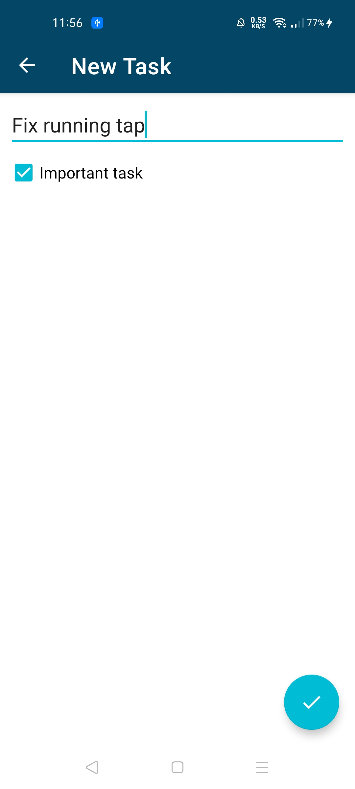
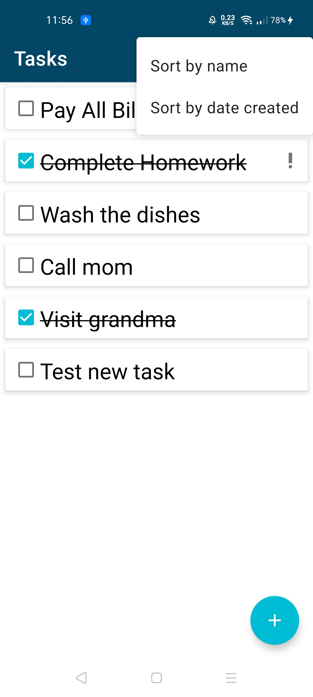
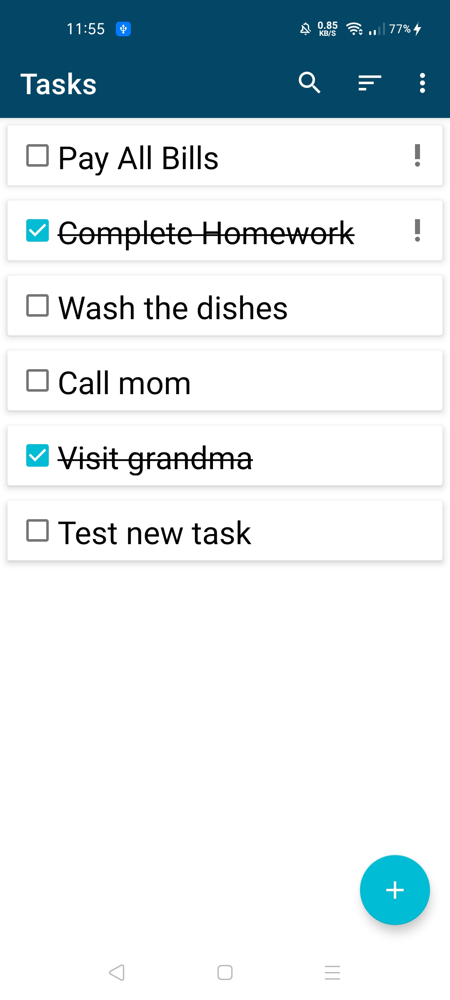

# DESCRIPTION
 
App Name - **MVVMTodo**

This is my first application written in kotlin.
Learnt a lot about using this awesome language with android studio.

It is a simpple TODO list app using MVVM achitecture pattern

# FEATURES

1. Data is stored in Room Database
2. Follows MVVM pattern
3. User can add TODO task
4. User can sort list by date or name
5. Delete task with swipe gesture
6. Search Tasks
7. Edit Tasks
8. User can set priority

# WHAT DID I LEARNED?

1. Using Kotlin for Android
2. Kotlin Coroutines
3. Android Architecture components
4. Jetpack Datastore
5. Dagger Hilt for dependency injection

# SCREENSHOTS

# DEPENDENCIES

`
// App dependencies
        appCompatVersion = "1.2.0"
        constraintLayoutVersion = "2.0.4"
        coroutinesVersion = "1.3.9"
        dataStoreVersion = "1.0.0-alpha02"
        espressoVersion = "3.3.0"
        fragmentVersion = "1.3.0-beta01"
        gradleVersion = "4.1.0"
        hiltAndroidXVersion = "1.0.0-alpha02"
        hiltVersion = "2.28.3-alpha"
        junitVersion = "4.13.1"
        kotlinVersion = "1.4.10"
        ktxVersion = "1.3.2"
        lifecycleVersion = "2.2.0"
        materialVersion = "1.3.0-alpha03"
        navigationVersion = "2.3.1"
        roomVersion = "2.2.5"
        testExtJunitVersion = "1.1.2"
        
    // Fragment
    implementation "androidx.fragment:fragment-ktx:$fragmentVersion"

    // Lifecycle + ViewModel & LiveData
    implementation "androidx.lifecycle:lifecycle-viewmodel-ktx:$lifecycleVersion"
    implementation "androidx.lifecycle:lifecycle-livedata-ktx:$lifecycleVersion"
    implementation "android.arch.lifecycle:common-java8:$lifecycleVersion"

    // Navigation Component
    implementation "androidx.navigation:navigation-fragment-ktx:$navigationVersion"
    implementation "androidx.navigation:navigation-ui-ktx:$navigationVersion"

    // Room
    implementation "androidx.room:room-runtime:$roomVersion"
    kapt "androidx.room:room-compiler:$roomVersion"
    implementation "androidx.room:room-ktx:$roomVersion"

    // Coroutines
    implementation "org.jetbrains.kotlinx:kotlinx-coroutines-core:$coroutinesVersion"
    implementation "org.jetbrains.kotlinx:kotlinx-coroutines-android:$coroutinesVersion"

    // Dagger Hilt
    implementation "com.google.dagger:hilt-android:$hiltVersion"
    kapt "com.google.dagger:hilt-android-compiler:$hiltVersion"
    implementation "androidx.hilt:hilt-lifecycle-viewmodel:$hiltAndroidXVersion"
    kapt "androidx.hilt:hilt-compiler:$hiltAndroidXVersion"

    // DataStore
    implementation "androidx.datastore:datastore-preferences:$dataStoreVersion"
`
